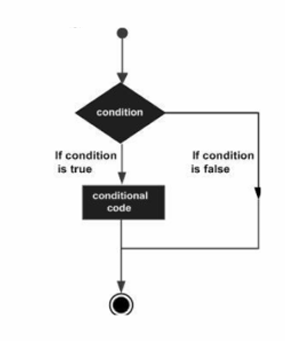

# Decision Making (Shartli Operatorlar) – Dart

Dart tilida qaror qabul qilish (decision making) uchun quyidagi shartli operatorlar ishlatiladi:

---

## CONDITION SXEMASI

Quyidagi diagramma shartli operatorlar (if/else) qanday ishlashini ko‘rsatadi:

<div align="center">
  
</div>

```
[Shart tekshiriladi]
     |
     v
[Agar shart to'g'ri bo'lsa] ----> [Kod bajariladi]
     |
     v
[Agar shart noto'g'ri bo'lsa] ---> [Boshqa kod yoki hech narsa]
```

---

## IF

`if` operatori shartni tekshiradi va shart to‘g‘ri bo‘lsa kodni bajaradi.

**Sintaksis va misol:**
```dart
int yosh = 18;
if (yosh >= 18) {
  print('Balog‘atga yetgan');
}
```
Yuqoridagi misolda, agar `yosh` 18 yoki undan katta bo‘lsa, "Balog‘atga yetgan" chiqadi.

---

## IF ELSE

`if else` operatori shart to‘g‘ri bo‘lmasa boshqa kodni bajaradi.

**Sintaksis va misol:**
```dart
int ball = 65;
if (ball >= 70) {
  print('Imtihondan o‘tdi');
} else {
  print('Imtihondan o‘tmadi');
}
```

---

## ELSE IF LADDER

Bir nechta shartlarni ketma-ket tekshirish uchun ishlatiladi.

**Sintaksis va misol:**
```dart
int baho = 4;
if (baho == 5) {
  print('A’lo');
} else if (baho == 4) {
  print('Yaxshi');
} else if (baho == 3) {
  print('Qoniqarli');
} else {
  print('Qoniqarsiz');
}
```

---

## NESTED IF…ELSE

`if` ichida yana `if` ishlatish mumkin.

**Sintaksis va misol:**
```dart
int yosh = 20;
bool passportBor = true;
if (yosh >= 18) {
  if (passportBor) {
    print('Saylovda qatnashishi mumkin');
  } else {
    print('Pasport kerak');
  }
} else {
  print('Yosh yetarli emas');
}
```
## SWITCH

`switch` operatori biror o‘zgaruvchining qiymatiga qarab bir nechta variantdan birini bajaradi. Bu operator ko‘p shartlarni ketma-ket if/else bilan yozishdan ko‘ra ancha qulay va o‘qilishi oson.

**Sintaksis:**
```dart
switch (qiymat) {
  case 1:
    // Kod
    break;
  case 2:
    // Kod
    break;
  default:
    // Kod
}
```

**Tushuntirish:**
- `switch` ichida har bir `case` bir qiymatni tekshiradi.
- Agar qiymat mos kelsa, shu case ichidagi kod bajariladi.
- `break` operatori case tugagandan so‘ng switch blokidan chiqib ketadi. Agar break yozilmasa, keyingi case ham bajariladi (bu "fall-through" deb ataladi).
- `default` esa hech bir case mos kelmasa ishlaydi.

**Misol:**
```dart
int day = 3;
switch (day) {
  case 1:
    print('Dushanba');
    break;
  case 2:
    print('Seshanba');
    break;
  case 3:
    print('Chorshanba');
    break;
  default:
    print('Boshqa kun');
}
```
Yuqoridagi misolda, `day` 3 bo‘lsa, "Chorshanba" chiqadi.

**break haqida chuqurroq:**
- Agar break yozilmasa, switch keyingi case’larni ham bajaradi:
```dart
int day = 2;
switch (day) {
  case 2:
    print('Seshanba');
    // break yo‘q!
  case 3:
    print('Chorshanba');
    break;
}
```
Natija:
```
Seshanba
Chorshanba
```
- Shuning uchun har bir case oxirida break yozish tavsiya etiladi.

**default case:**
- default case har doim oxirida bo‘lishi shart emas, lekin odatda oxirida yoziladi.
- default case switch ichida hech bir case mos kelmasa bajariladi.

**Switch operatori qachon ishlatiladi?**
- Biror o‘zgaruvchining bir nechta aniq qiymatlari bo‘lsa va har bir qiymat uchun alohida kod bajarilishi kerak bo‘lsa.
- Masalan, menyu tanlash, kun nomlari, status kodlar va boshqalar.

---

# TASKS

Quyidagi masalalar shartli operatorlarni mustahkamlash uchun berilgan. Ularni yechish – nazariyani amalda ko‘rish uchun foydali.

- **Task1:** Agar berilgan son 20 ning ko`paytmasidan 1 yoki 2 ga ortiq bo`lsa true qiymatni Console da chiqaring.
- **Task2:** Manfiy bo`lmagan “num” raqami berilgan, agar son 10 ga qoldiqsiz bo`linuvchi sonlarga ko`pi bilan 2 tagacha farq qilsa true qiymatni Console da chiqaring.
- **Task3:** Ikkita a va b butun son berilgan, ularning yig`indisini Console da chiqaring. Agar, ularning yig`indisi 10…19 oraliqda o`zgarsa, yig`indini o`rniga 20 qiymatni chiqaring.

**Eslatma:**  
Tasklar yechimi faqat nazariyani mustahkamlash uchun. Har bir taskni o‘zingiz yechib ko‘ring!

---

## Qo‘shimcha: Mukammal IF Misollari

### 1. Oddiy shart
```dart
if (a > b) print('a katta');
```

### 2. Bir nechta shart
```dart
if (a > 0 && b > 0) print('Ikkalasi ham musbat');
```

### 3. Ternary operator
```dart
String natija = (a % 2 == 0) ? 'Juft' : 'Toq';
print(natija);
```

### 4. Switch misoli
```dart
int day = 3;
switch (day) {
  case 1:
    print('Dushanba');
    break;
  case 2:
    print('Seshanba');
    break;
  default:
    print('Boshqa kun');
}
```

---

**Xulosa:**  
Dartda shartli operatorlar yordamida kodni mos ravishda boshqarish, turli vaziyatlarda turli natijalarni olish mumkin. Har bir task va misol real hayotdagi muammolarni yechishda yordam beradi.